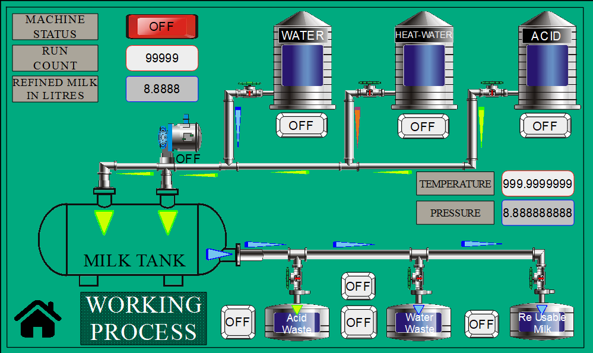
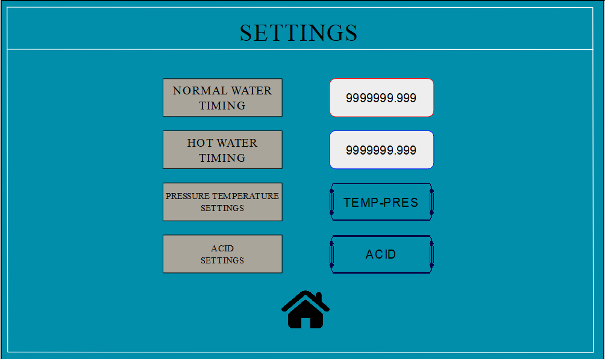
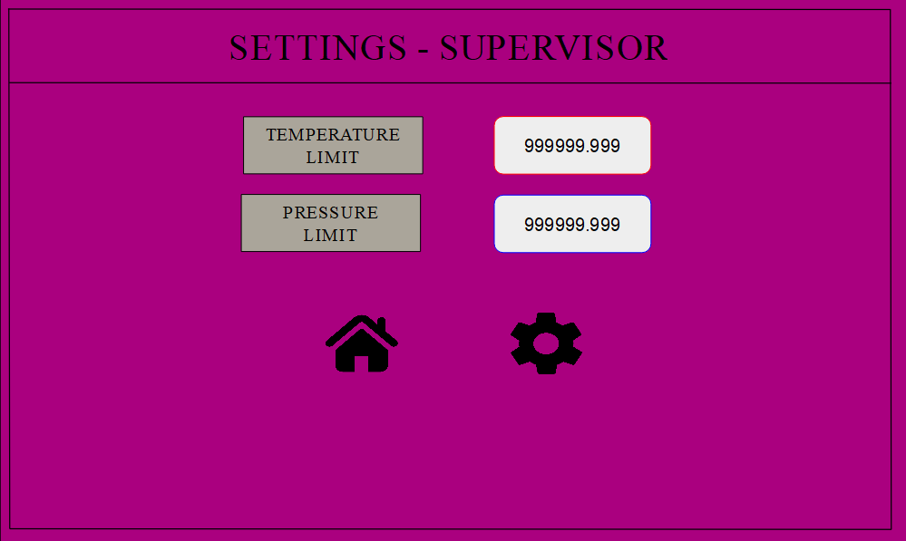
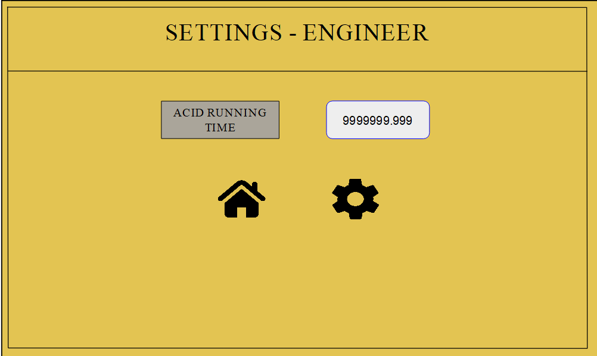

# HMI Screens for Milk Tank Washer

This repository showcases HMI screens developed for monitoring and controlling the automated cleaning process of a milk storage tank.

## 📸 Screenshots

| Page | Description |
|------|-------------|
| [Home page](images/PAGE-1.png) | Home with logo, date/time, and navigation |
|  | Visual overview of the milk tank cleaning process in real-time. |
|  |  Basic settings panel available to all users |
|  |  Supervisor-level settings for process adjustments and monitoring |
|  |  Engineer-level settings for advanced configuration and diagnostics |

> 📂 All HMI screen images are located in the `/images` folder.

## 💻 Tools Used
- **HMI Designer: Atsel Software** 
- **PLC Platform: Selpro Software** (PLC programming software by Selec)

